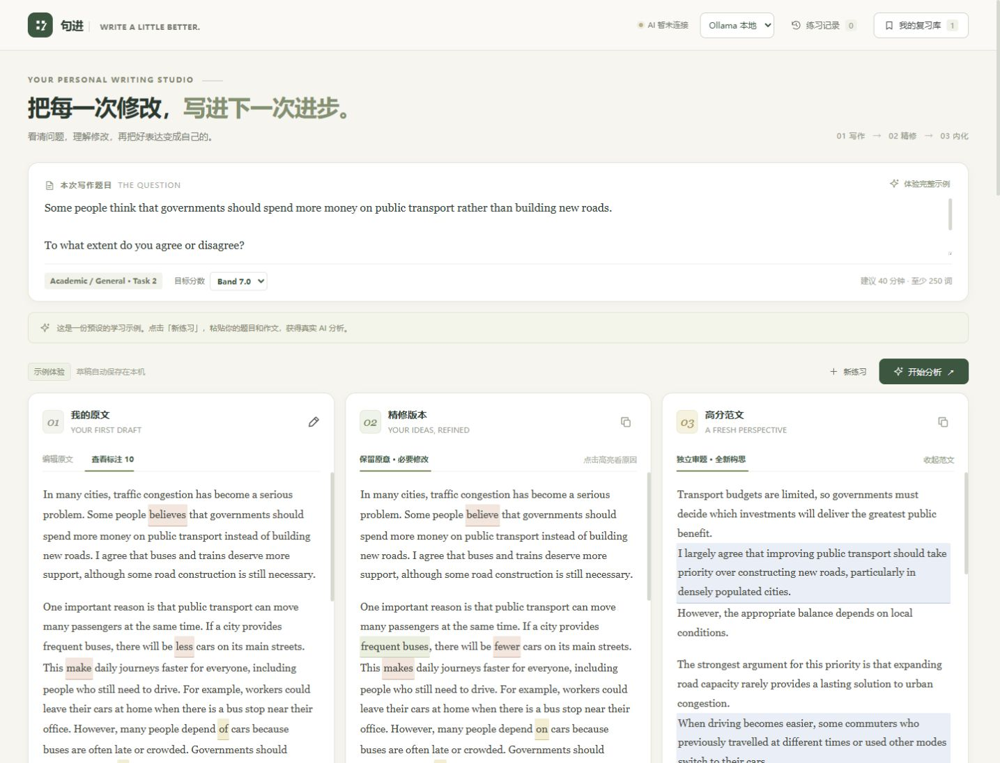

# IELTS Writing Studio · 句进

[简体中文](README.md) · [Download v0.1.0](https://github.com/wang-qingfeng-dev/ielts-writing-studio/releases/tag/v0.1.0) · [Changelog](CHANGELOG.md)

A local IELTS Writing Task 2 practice app that turns essay feedback into reusable learning cards. Compare your draft, a minimally corrected version, and an independently generated model essay, then practise the language you want to retain.

The learning interface and feedback explanations are in Simplified Chinese; essays and practice sentences are in English. **AI band estimates are learning feedback, not official IELTS results or a promise of improvement.** This project is not affiliated with IELTS.



## The learning workflow

| Your original | Minimal correction | Independent model |
| --- | --- | --- |
| Write or paste an essay and inspect highlighted issues | Fix grammar, spelling and collocations while retaining the argument | Explore another argument generated from the question and target band only |
| Review evidence for TR, CC, LR and GRA estimates | See why grammar fixes may leave reasoning weaknesses | Inspect useful expressions and reasoning moves |

Click a highlight to see the source, revision, explanation and a short exercise. The app prioritizes three actions per essay, offers spaced review at 1/3/7/14/30 days, stores up to 30 exercises in the browser, and exports Markdown study notes. A labelled built-in example works without a model.

## Run locally

### Windows portable download

Download [ielts-writing-studio-v0.1.0-windows-x64.zip](https://github.com/wang-qingfeng-dev/ielts-writing-studio/releases/download/v0.1.0/ielts-writing-studio-v0.1.0-windows-x64.zip), extract the entire archive, then double-click `Start Portable.cmd`. The Windows x64 package includes Node.js, so no separate Node installation is needed. **AI models are not bundled:** the labelled example is available immediately; real analysis requires a provider configured below.

### Run from source (Windows, macOS or Linux)

Install [Node.js 24 LTS](https://nodejs.org/) (minimum 22.9). Download and extract the release source ZIP, or clone:

```sh
git clone https://github.com/wang-qingfeng-dev/ielts-writing-studio.git
cd ielts-writing-studio
npm start
```

No `npm install` is needed: the server uses Node built-ins and the UI uses native browser modules. Open [http://127.0.0.1:4318](http://127.0.0.1:4318). The example is usable immediately; real analysis needs one of the providers below. On Windows, `Start Writing Studio.cmd` starts the server in the background and opens the page.

If npm is unavailable, use `node --env-file-if-exists=.env server.mjs`.

### Local model with Ollama

Install and start [Ollama](https://ollama.com/), then download a model:

```sh
ollama pull qwen2.5:7b
```

Select **Ollama 本地** in the page header. Local inference needs no API key or hosted API subscription, but uses your computer's memory and compute. The suggested model is a starting configuration, not a validated IELTS assessor; feedback quality, speed and schema reliability vary.

To change models or configure an API, copy `.env.example` to `.env` (Windows: `Copy-Item .env.example .env`; macOS/Linux: `cp .env.example .env`), edit it and restart the server. Both `npm start` and the Windows launcher load this file. Existing shell variables take precedence.

### Compatible API or optional Codex CLI

For an OpenAI-compatible Chat Completions service, configure:

```dotenv
AI_PROVIDER=openai-compatible
AI_BASE_URL=https://your-provider.example/v1
OPENAI_MODEL=your-provider-model-name
AI_API_KEY=your-server-side-key
```

Replace these placeholders with your provider's values. A locally hosted compatible service may not require a key. Support depends on the provider's API and model; this release does not certify every compatible service. Costs and quotas are controlled by the provider.

The optional **Codex CLI** choice uses your own installed, authenticated CLI and account quota. It is never selected as an automatic fallback. No author's credentials or subscription are included.

| Setting | Purpose |
| --- | --- |
| `AI_PROVIDER` | `ollama`, `openai-compatible`, `codex`, or `auto` |
| `OLLAMA_HOST` | Defaults to `http://127.0.0.1:11434` |
| `OLLAMA_MODEL` | Defaults to `qwen2.5:7b` |
| `AI_BASE_URL`, `OPENAI_MODEL`, `AI_API_KEY` | Compatible service configuration; key stays server-side |
| `AI_MODEL` | Legacy fallback if a provider-specific model is unset |
| `IELTS_CODEX_PATH` | Optional path to the installed Codex executable |
| `PORT` | Local port; default `4318` |

The header selects a provider for the current server session. **Auto** prefers a responding Ollama service, then an explicitly configured API; otherwise it reports Ollama unavailable. An installed Ollama model is still required. Restarting restores the environment configuration. Switching is disabled during analysis.

## Privacy and scope

- The server listens on `127.0.0.1` only and rejects cross-site requests. It is a single-user local app, not a hardened multi-user hosting service.
- Drafts, exercise history and review cards stay in that browser's local storage; they are not encrypted or synchronized. Export important work before clearing browser data or changing origin/port.
- Submitted writing goes to the selected provider. With the default loopback Ollama configuration, inference stays local. An external API, remote Ollama host or Codex service receives the relevant content under its own terms.
- Correction and model-essay generation use separate requests. The model-essay request omits the student's draft. Outputs must pass score, structure and exact quotation checks; failures never silently substitute demo feedback.
- Keys, local logs and live test results are ignored by Git. Never put credentials in `public/`.
- v0.1.0 covers Task 2 only. It does not include Task 1, cloud sync, accounts, a public inference service, or validated prediction of official bands. GitHub Releases distributes code; it does not host the Node backend.

See [Security](SECURITY.md), [third-party boundaries](THIRD_PARTY_NOTICES.md) and [verification](docs/release-verification-v0.1.0.md).

## Development

```sh
node --test tests/*.test.mjs
```

The v0.1.0 release passed 56 automated tests. The suite covers request boundaries, annotation validation, independent model context, provider selection, mocked HTTP integrations, cancellation, rendering safety and draft/review state. CI runs on Node 22 and 24.

An optional live check submits the included test essay to a running configured service and may use account quota:

```sh
node tests/live-check.mjs
```

| Path | Responsibility |
| --- | --- |
| `public/` | UI, draft storage, annotations, study cards and demo data |
| `server.mjs` | Local HTTP API, independent analysis jobs and process isolation |
| `provider.mjs` | Ollama, compatible API and optional CLI adapters |
| `http-json.mjs` | Bounded HTTP requests with cancellation and whole-request deadlines |
| `analysis-schema.mjs` | JSON schemas, band boundaries and source validation |
| `tests/` | Automated regression tests and optional live check |
| `CONTRACT.md` | API and UI structure |

## License and references

[MIT](LICENSE), copyright WANG QINGFENG. Model weights, provider services and external IELTS materials retain their own terms; see [Third-party notices](THIRD_PARTY_NOTICES.md).

Scoring dimensions refer to the [official IELTS explanation](https://ielts.org/take-a-test/your-results/ielts-scoring-in-detail). This app's generated scores are not examiner assessments.
